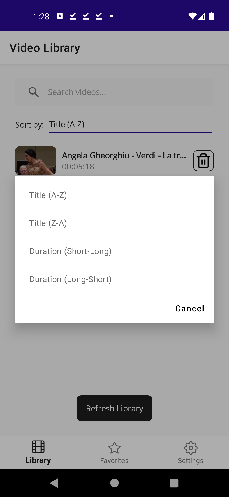
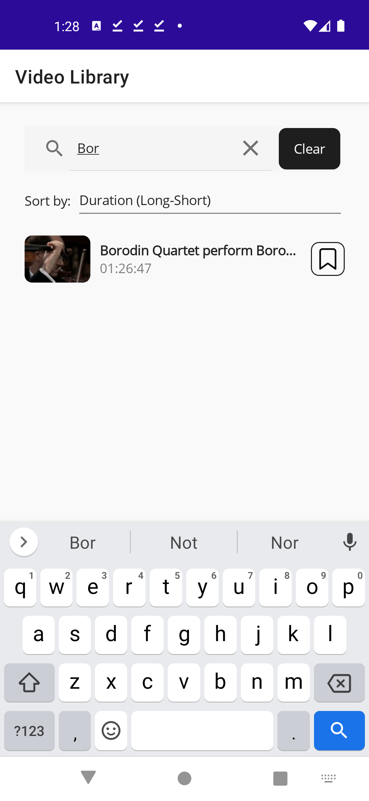
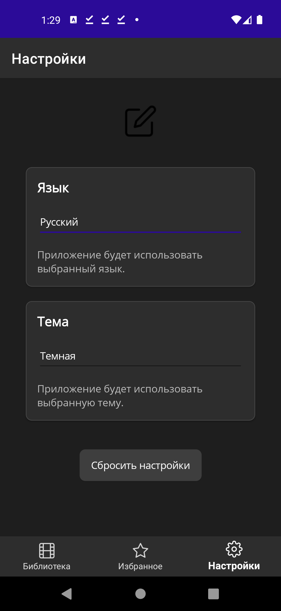
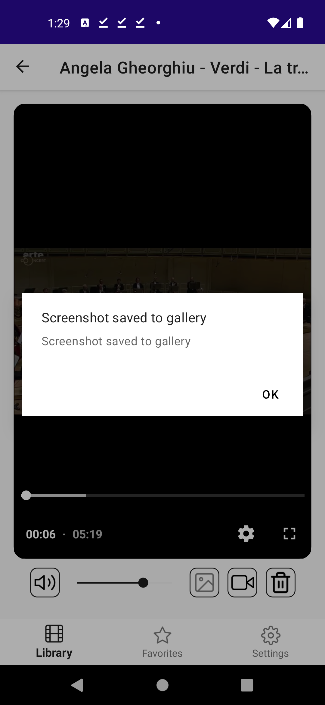
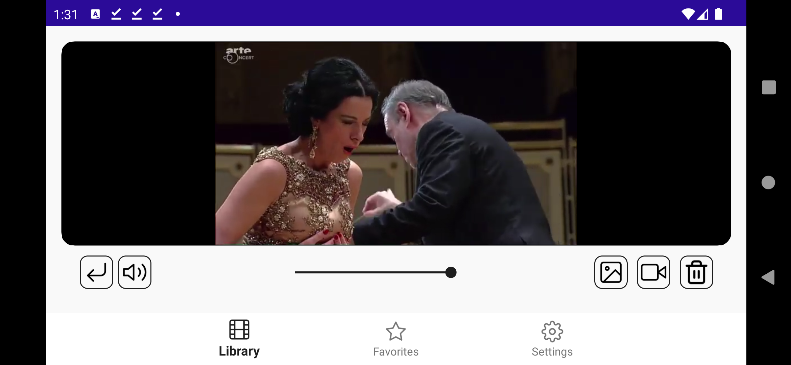

# The Lighthouse Waves Video Player

A modern video player application for Android built with .NET MAUI, featuring intelligent video management, multilingual support, and enhanced playback capabilities.

| | | |
|:---:|:---:|:---:|
|  |  |  |
|  |  |  |
|  |  |  |
|  |  |  |
|  |  |  |

### V 1.1
| | |
|:---:|:---:|
|  |  |

### Example of using the application

## Features

**🎥 Media Management**
- Automatic video discovery from local storage
- Favorites system with persistent storage
- Advanced sorting (title, duration) and search
- Thumbnail previews for videos
- Playlist system with creation, management and playback capabilities

**🎬 Playback Engine**
- Resume playback functionality
- Screenshot capture capability
- Media metadata display (resolution, duration, file info)
- Playlist navigation with next/previous controls
- Repeat modes (none, all, single video)

**🌍 Localization**
- English & Russian support
- Dynamic resource updates

**🎨 Personalization**
- Light/Dark themes

**⚙️ Technical Features**
- MVVM architecture
- MediaElement integration
- Robust error handling

## Supported Platforms
- Android

## Contributions

Contributions are welcome! Please feel free to submit a Pull Request.

## Author

Bohdan Harabadzhyu

## License

This project is licensed under the MIT License - see the [LICENSE](LICENSE) file for details.

## YouTube Review

📺 Watch Video Review

